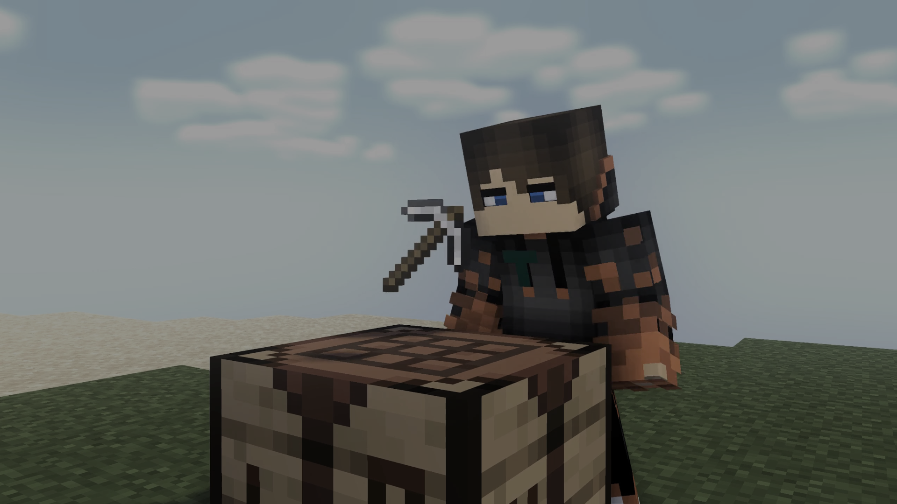

Hi! I'm <b>ToCraft</b>, <i>aka</i> <b>To_Craft</b><i>, former known as </i><b>Minecraft_Pi</b>.

`Minecraft-Modder and modded Minecraft player`

My Mod I'm working on rn: https://curseforge.com/minecraft/mc-mods/woodwalkers

I started with Python on a Linux server, so I know my way around Linux, Python and Java.

I also once created a multiplayer shooter with Unity, so I also know a bit about C#.

Furthermore, I'm very intersted in IT-Security and similar stuff, therefore, I'm a [Kali Linux](https://www.kali.org/) user.

Finally, I once programmed an AI with [Tensorflow](https://www.tensorflow.org/).
